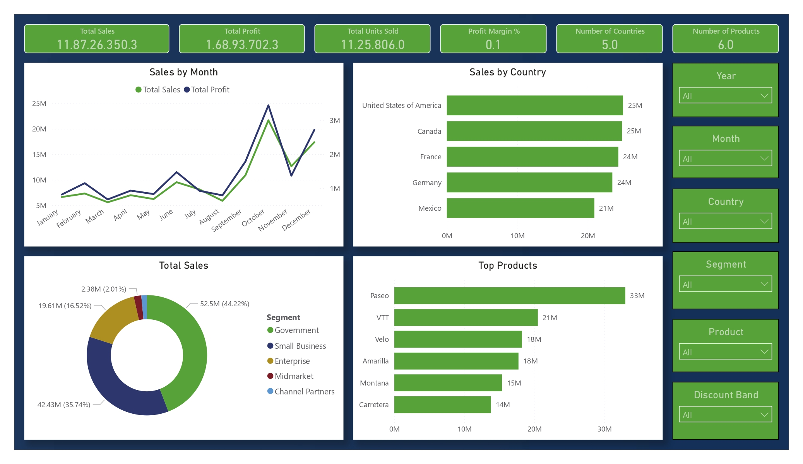

# Financial Sales Analysis Project

## Project Objective
This project demonstrates an end-to-end data analytics workflow using Excel, PostgreSQL (pgAdmin), and Power BI. The goal of the project is to analyze financial sales data to identify business insights such as top-performing countries, profitable products, and sales trends.

## Dashboard

## Dataset used

Total Records: 700 
<a href="Financials-org.csv" target="_blank">Financials-org.csv</a>  
Columns Included: 

1. Segment	Country 
2. Product 
3. Discount_Band 
4. Units_Sold 
5. Manufacturing_Price 
6. Sale_Price 
7. Gross_Sales 
8. Discounts 
9. Sales 
10. COGS 
11. Profit 
12. Date 
13. Month_Number 
14. Month_Name 
15. Year

## Business Questions Solved

<a href="Financials_Dashboard.pdf" target="_blank">All Pages Financials_Dashboard.pdf</a>  

1. Which country generates the highest sales revenue? 
2. Which products contribute the most profit? 
3. Which customer segment performs best? 
4. How do discounts impact overall profitability? 
5. What are the monthly sales trends? 
6. Which products have the highest sales volume?

## Process
1. Data Cleaning 
2. SQL Querying 
3. Database Management 
4. Data Visualization 
5. Business Intelligence Analysis

## Project Insight
The financial sales dataset analysis shows that the Midmarket segment generated the highest overall sales, indicating strong demand from medium-sized customers. Among all products, Amarilla performed as the top-selling product, contributing significantly to revenue growth. Country-wise analysis highlights the United States of America as the leading market with the highest sales performance.

## Final Conclusion
Overall, the analysis reveals that focusing on the Midmarket customer segment and high-performing products like Amarilla can significantly improve business revenue. The United States market presents the strongest sales opportunity and should be prioritized for future strategies. Leveraging data-driven insights through Excel, pgAdmin, and Power BI helps identify profitable markets and optimize business decisions.
